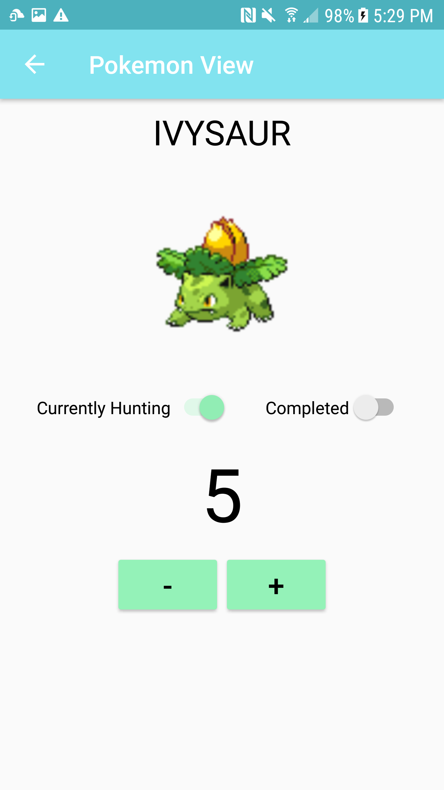

# PokeTrack - Mobile Shiny Pokemon Tracker
Poketrack is an app developed to keep track of shiny Pokemon encounters on the go.

### Key Features
- Look through a Pokedex loaded from an API
- Add Pokemon to a Currently HUnting List
- Mark Pokemon completed once they're finished

### Preview Images

